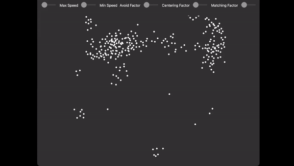

# Boids Simulation

## Overview


The Boids Simulation is a Python application that demonstrates the behavior of a flock of birds (boids) in a window. This project uses PySide6 to create a graphical user interface (GUI) for the simulation. 

Origin of the Concept: The term "boids" was coined by computer scientist Craig Reynolds in 1986, as part of his research into simulating the flocking behavior of birds. Reynolds developed a set of simple rules that govern the behavior of individual agents (boids) within a group. These rules include alignment (matching the direction of neighbors), cohesion (moving toward the center of mass of neighbors), and separation (avoiding collisions with neighbors).

Biological Inspiration: The foundation of boid research lies in its biological inspiration, primarily the flocking behavior of birds, but also the schooling of fish and the swarming of insects. Scientists have observed that these animals, despite their limited cognitive abilities, can exhibit highly coordinated group behaviors. Boid models aim to capture the underlying principles responsible for such emergent phenomena.

Complex Systems: Boid simulations are part of a broader field known as complex systems. They exemplify how simple, local interactions among individuals can lead to complex global behaviors. This research offers insights into self-organization, criticality, and emergent properties in various systems, including ecological, social, and economic systems.
## Features

- Simulates the movement of a flock of boids.
- Customizable parameters for the simulation, such as the number of boids, their speed, and appearance.
- Real-time rendering of boids using PySide6's QPainter.

## Requirements

- Python 3
- PySide6 library (install with `pip3 install PySide6`)

## How to Run

1. Ensure you have Python 3 and PySide6 installed.

2. Clone this repository to your local machine:
   ```bash
   git clone https://github.com/colechang/BoidsPySide.git
   ```

<!--## Example -->

## References
- https://www.cs.toronto.edu/~dt/siggraph97-course/cwr87/
- https://vanhunteradams.com/Pico/Animal_Movement/Boids-algorithm.html
