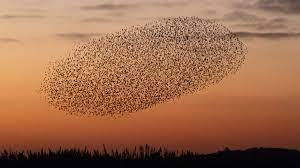

# Boids Simulation

## Overview



The Boids Simulation is a Python application that demonstrates the behavior of a flock of birds (boids) in a window. This project uses PySide6 to create a graphical user interface (GUI) for the simulation. 

Boids is a concept in computational modeling and artificial intelligence that simulates the emergent behavior of a group of autonomous agents, such as birds, fish, or other entities, by employing simple rules of interaction. This approach was originally developed by Craig Reynolds in 1986 to capture the captivating complexity of collective motion seen in flocks of birds or schools of fish.

Boids models the behavior of individual agents based on three fundamental principles: separation, alignment, and cohesion. Separation ensures that agents avoid collisions by maintaining a minimum distance from one another, alignment fosters a sense of alignment with the velocities of nearby agents, and cohesion encourages agents to stay close to their neighbors, creating group cohesiveness.

This elegant and computationally efficient approach enables the simulation of mesmerizing patterns of collective behavior, highlighting how seemingly complex and coordinated group dynamics can emerge from the interaction of relatively simple, localized rules. Boids has found application in a wide range of fields, from computer graphics and video game design to robotics and traffic flow optimization, and continues to serve as a valuable model for understanding and simulating the self-organization of multi-agent systems.
## Features

- Simulates the movement of a flock of boids.
- Customizable parameters for the simulation, such as the behaviour and speed
- Real-time rendering of boids using PySide6's QPainter.

## Requirements

- Python 3
- PySide6 library (install with `pip3 install PySide6`)

## How to Run

1. Ensure you have Python 3 and PySide6 installed.

2. Clone this repository to your local machine:
   ```bash
   git clone https://github.com/colechang/BoidsPySide.git
   ```

<!--## Example -->

## References
- https://www.cs.toronto.edu/~dt/siggraph97-course/cwr87/
- https://vanhunteradams.com/Pico/Animal_Movement/Boids-algorithm.html
